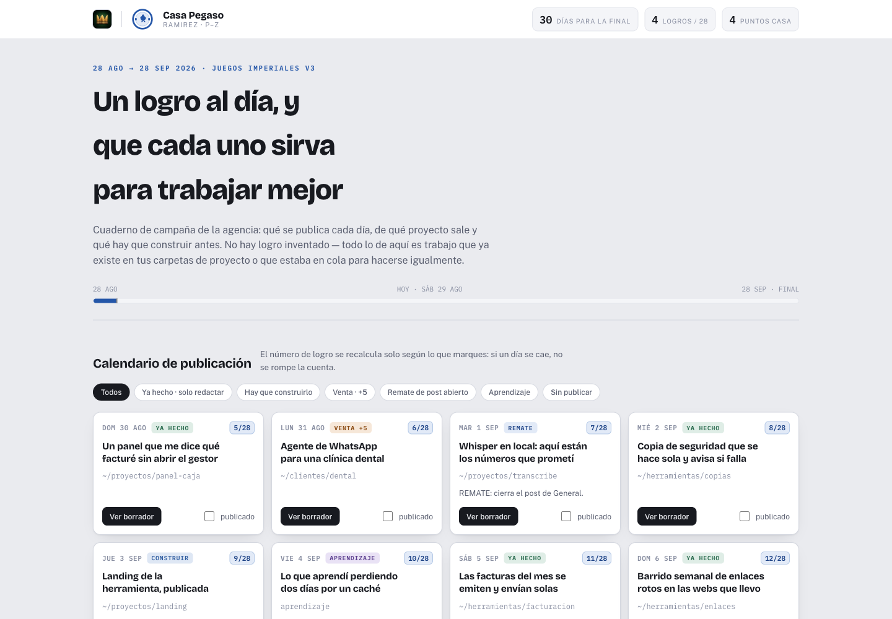

# Cuaderno de campaña — Juegos Imperiales

**Plantilla interna de la comunidad Imperio Agéntico.** Repositorio privado: se
entra por invitación (ver abajo).

---

Publicar un logro al día durante un mes no falla por falta de trabajo hecho.
Falla porque a las once de la noche no te acuerdas de lo que hiciste en junio, y
ese día lo pierdes.

Esta skill escanea tus propias carpetas de proyecto, encuentra lo que ya tienes
terminado y te devuelve un panel con **el mes entero repartido** y el borrador de
cada post ya escrito en texto plano, listo para pegar en Skool.



## Cómo entrar

El repositorio es privado y es solo para gente de Imperio.

1. Mándame tu correo de GitHub **por privado** en la comunidad.
2. Te llega la invitación al repositorio.
3. Aceptas y ya puedes clonar.

No lo compartas fuera de Imperio. Si alguien de la comunidad lo quiere, que pida
su propia invitación — así sabemos quién lo tiene.

## Instalar

```bash
git clone https://github.com/flopez1977/skill-juegos-imperiales.git \
  ~/.claude/skills/juegos-imperiales
```

Y en Claude Code: **«monta mi cuaderno de campaña»**.

Te hará seis preguntas, escaneará lo que le digas y te dejará el panel.

## Qué hace

- Te asigna tu casa por el primer apellido (acentos y Ñ resueltos) y pinta el
  panel con el color de tu casa: Águila en rojo, Grifo en oro, Pegaso en azul.
- Barre tus carpetas y clasifica cada proyecto en terminado / en curso / parado.
- Reparte los logros por días y deja colchón al final, para que perder un día no
  rompa el mes.
- Te avisa de lo que ya publicaste para que no te repitas.
- Escribe el borrador de cada post con la cabecera y los bloques de la temporada.
- Marca cuáles son ventas (que puntúan aparte) y cuáles son remates de algo que
  dejaste a medias en General — esos son los mejores y los más baratos.

## Cualquier temporada

Las reglas viven en `temporadas/*.json`: fechas, casas y sus cortes de letra,
tabla de puntos, meta de logros y formato del post. Para la V4 se copia el
fichero y se cambian los números. El motor no se toca.

## Privacidad

**Nada sale de tu máquina.** Los scripts no hacen ninguna llamada de red, no
tienen dependencias fuera de la librería estándar de Python y no envían
telemetría. Puedes leerlos enteros en diez minutos, y el CI tumba el build si
alguien mete una librería de red en `scripts/`.

Del escaneo:

- Solo abre `LOG.md`, `README.md` y `CLAUDE.md`. Nada más, sin comodines.
- No entra en directorios ocultos, `node_modules`, `.ssh`, `.aws` ni similares.
- Todo lo que lee pasa por un filtro que tacha claves de API, contraseñas,
  cadenas de conexión, correos e IPs privadas antes de escribir nada.
- Si el filtro tacha algo, te dice en qué proyecto: significa que tienes
  credenciales en claro en tus diarios y conviene que lo sepas.

Aun así: **el panel que genera es privado.** Lleva nombres de tus proyectos y
probablemente de tus clientes. Léelo antes de enseñárselo a nadie, y no subas la
captura entera a la comunidad sin mirarla.

## Tests

```bash
python3 -m pytest tests/ -q     # 34 tests
```

Requiere Python 3.10 o superior. Sin dependencias.

## Créditos y uso

Hecho para Imperio Agéntico. El escudo y la marca de Imperio son de la
comunidad, no míos: están aquí porque esto es una plantilla interna. Si alguna
vez se sacara fuera, habría que quitarlos o pedir permiso.

El código es tuyo para usarlo y adaptarlo dentro de Imperio.
